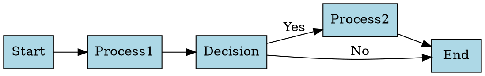

# DOT File Mock Server

A simple Fastify-based file server for uploading and serving DOT diagram files. This is designed for local testing and demos of the Grafana Graphviz Panel plugin.

## Features

- **POST** endpoint to upload DOT files
- **GET** endpoint to retrieve the uploaded DOT file
- CORS enabled for cross-origin requests
- Health check endpoint
- Minimal code (~70 lines)

## Quick Start

### Using Docker Compose (Recommended)

From the project root:

```bash
docker-compose up dot-mock-server
```

The server will be available at `http://localhost:3001`

### Using Node.js Locally

```bash
cd mock-server
npm install
npm start
```

For development with auto-reload:

```bash
npm run dev
```

## API Endpoints

### POST /dot

Upload a DOT diagram file.

**Example with curl:**

```bash
curl -X POST -F "file=@diagram.dot" http://localhost:3001/dot
```

**Example with httpie:**

```bash
http -f POST localhost:3001/dot file@diagram.dot
```

**Response:**

```json
{
  "success": true,
  "message": "DOT file uploaded successfully",
  "filename": "diagram.dot",
  "size": 1234
}
```

### GET /dot

Retrieve the uploaded DOT diagram file as plain text.

**Example:**

```bash
curl http://localhost:3001/dot
```

**Response:**

```
digraph {
  A -> B;
  B -> C;
}
```

### GET /health

Health check endpoint.

**Example:**

```bash
curl http://localhost:3001/health
```

**Response:**

```json
{
  "status": "ok"
}
```

## Using with Grafana Graphviz Panel

1. Start the mock server (see Quick Start above)
2. Upload a DOT file to the server:
   ```bash
   curl -X POST -F "file=@your-diagram.dot" http://localhost:3001/dot
   ```
3. In your Grafana panel settings:
   - Set **Diagram Source** to "URL"
   - Enter URL: `http://localhost:3001/dot`
4. The panel will fetch and render the DOT diagram

## Example DOT Files

Create a test file (`test.dot`):



Upload it:

```bash
curl -X POST -F "file=@test.dot" http://localhost:3001/dot
```

## Environment Variables

- `HOST` - Server host (default: `0.0.0.0`)
- `PORT` - Server port (default: `3001`)

## File Storage

Uploaded files are stored in the `uploads/` directory as `diagram.dot`. Each new upload overwrites the previous file.

## Notes

- This is a **mock server** for local development and demos only
- Not intended for production use
- No authentication or authorization
- Single file storage (latest upload overwrites previous)
- CORS is enabled for all origins
