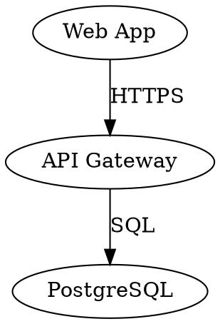
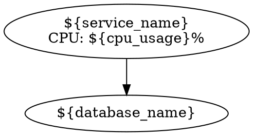
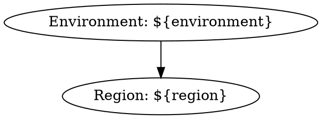
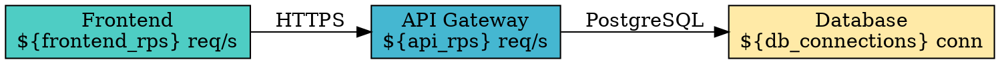
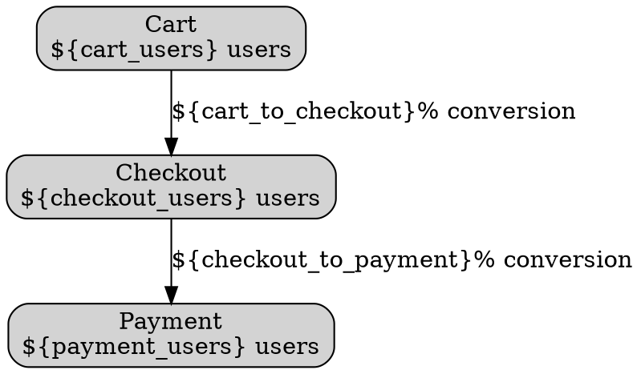

# Graphviz Panel

[](https://grafana.com)
[](LICENSE)

> ℹ️ **Private Preview**: This plugin is currently in [Private Preview](https://grafana.com/docs/release-life-cycle/#private-preview) release status. It is not intended for production environments. Support from Grafana is limited, and no SLA is provided.

Visualize relationships, flows, and architectures using the Graphviz DOT language with live metrics from any Grafana data source.

Define diagrams as code, bind metrics to visual properties, and let Graphviz layout engines handle the rest. Perfect for service topologies, business processes, infrastructure architectures, and organizational structures that update automatically with your data.


## Why Graphviz Panel?

**Map metrics to your mental models.** Grafana excels at time-series visualization, but operational insights often live in the relationships between things: service dependencies, business workflows, network topologies. This panel bridges that gap.

**Diagrams as code.** Define once, reuse everywhere. Scale across your organization with infrastructure-as-code. Grafana AI Assistant is already fluent in DOT syntax.

**Data-driven diagrams.** Color nodes by health thresholds, update labels with live values, scale edge widths by throughput—all from your existing data sources.

## Quick Start

### 1. Choose Your Input Mode

The panel supports three ways to create diagrams:

| Mode             | Best For                         | Data Required                 |
| ---------------- | -------------------------------- | ----------------------------- |
| **Builder mode** | Visual construction without code | None (manual drag-and-drop)   |
| **Code mode**    | Full control via DOT syntax      | Static DOT string or template |
| **Query mode**   | Queried from a data source       | DataFrame with DOT column     |

### 2. Builder Mode (No Code Required)

1. Add a new panel and select **Graphviz** visualization
2. Set **Input mode** to **Builder**
3. Click **Add Node** or **Add Edge** to construct your diagram visually
4. Configure layout engine (hierarchical, network, circular, etc.)
5. Add queries and bind metrics to node colors, labels, or edge widths

### 3. Code Mode (Full DOT Syntax)

1. Set **Input mode** to **Code**
2. Write your diagram in DOT syntax:



3. Use dashboard variables for dynamic content:



- **SEE:** [Graphviz documentation](https://graphviz.org/doc/info/lang.html) for a complete DOT language reference

### 4. Query Mode (Data-Driven)

Return a DataFrame with a column containing DOT syntax:

**Example query result:**

| timestamp           | dot_diagram                |
| ------------------- | -------------------------- |
| 2026-04-14 10:00:00 | `digraph { A -> B -> C; }` |

The panel automatically renders the DOT string from your query.

- **SEE:** [Grafana Infinity plugin](https://grafana.com/grafana/plugins/yesoreyeram-infinity-datasource/) to query APIs, files, and other sources for dynamic DOT diagrams

## Mapping Metrics to Visual Properties

Make diagrams dynamic by binding data to visual elements:

### Node Overrides

Target nodes by ID or pattern and map metrics to properties:

1. Open panel settings → **Node Overrides**
2. Add override rule (e.g., match nodes with ID pattern `server-*`)
3. Set **Color by field** or **Label template**

**Example: Color by CPU threshold**

- Field: `cpu_usage`
- Thresholds: Green (< 70%), Yellow (70-90%), Red (> 90%)

### Edge Overrides

Control edge appearance based on data:

**Example: Edge width by throughput**

- Field: `requests_per_sec`
- Width: Map 0-1000 req/s to 1-10px width

### Label Templates

Use `${field_name}` syntax to inject live data matched to a node or edge by ID:

```
${service_name}
CPU: ${cpu_usage}%
Mem: ${memory_usage}GB
```

### Named Thresholds

Define reusable color schemes:

1. Panel settings → **Named Thresholds**
2. Create threshold (e.g., "Health Status")
3. Apply to multiple nodes/edges by field value

## Layout Engines

Graphviz provides multiple layout algorithms. Choose based on your diagram structure:

| Layout Engine | Algorithm      | Best For               | Example Use Case              |
| ------------- | -------------- | ---------------------- | ----------------------------- |
| **dot**       | Hierarchical   | Top-down flows         | CI/CD pipelines, org charts   |
| **neato**     | Network        | Interconnected systems | Service meshes, peer networks |
| **fdp**       | Force Directed | Organic clustering     | Microservice dependencies     |
| **circo**     | Circular       | Radial relationships   | Hub-and-spoke architectures   |

Configure in panel settings → **Layout Engine**.

## Styling Options

### Spline Types

Control edge routing:

- **Polyline** - Straight line segments
- **Curved** - Smooth Bézier curves
- **Orthogonal** - Right-angle connections

### Rank Direction

Control flow direction (applies to `dot` layout):

- **TB** (Top to Bottom)
- **LR** (Left to Right)
- **BT** (Bottom to Top)
- **RL** (Right to Left)

## Advanced Features

### Dashboard Variables

Use Grafana variables in DOT syntax:



### Tooltips and Data Links

Configure rich tooltips that appear when hovering or clicking nodes/edges:

1. In **Node Overrides** or **Edge Overrides**, add a **Tooltip** rule
2. Set tooltip content template using `${field_name}` syntax
3. Add data links to drill down to other dashboards or external URLs
4. Click any node/edge to pin the tooltip; hover over links to preview

**Example tooltip template:**

```
CPU: ${cpu_usage}%
Memory: ${memory_mb}MB
Status: ${status}
```

Tooltips support dashboard variables, field values, and special context variables like `${__source}` and `${__target}` for edges.

### Advanced DOT Features

The panel supports all Graphviz DOT features including:

- **[HTML-like labels](https://graphviz.org/doc/info/shapes.html#html)** - Rich text formatting with tables
- **[Record-based nodes](https://graphviz.org/doc/info/shapes.html#record)** - Structured node layouts with ports
- **[Subgraphs and clusters](https://graphviz.org/doc/info/lang.html#subgraphs-and-clusters)** - Group related nodes visually
- **[Custom shapes and styles](https://graphviz.org/doc/info/shapes.html)** - Full shape catalog support

### Generate Diagrams-as-Code from Infrastructure-as-Code

Use external tools to generate DOT diagrams automatically:

**Terraform:**

```bash
# Generate infrastructure graph
terraform graph > diagram.dot
```

- **SEE:** [Terraform graph](https://developer.hashicorp.com/terraform/cli/commands/graph)

**Helm/Kubernetes:**

```bash
# Use kubectl graph plugin
kubectl krew install graph
kubectl graph deployments --namespace prod > k8s-deps.dot
```

- **SEE:** [kubectl-graph](https://github.com/steveteuber/kubectl-graph)

Store generated DOT files in your repository and load them via Query mode, or use Grafana provisioning to automatically update diagrams from CI/CD pipelines.

## Configuration Reference

### Panel Options

Configure in panel settings:

- **Input mode** - Builder, Code, or Query mode
- **Layout engine** - dot, neato, fdp, or circo
- **Rank direction** - TB, BT, LR, or RL (dot layout only)
- **Spline type** - Polyline, Curved, or Orthogonal edge routing

### Node/Edge Overrides

Target elements by ID or pattern to apply rules:

- **Color by field** - Map data field to colors via thresholds
- **Label template** - Use `${field_name}` syntax for dynamic labels
- **Width by field** - Scale edge widths by data values (edges only)

The panel supports all [standard Grafana panel options](https://grafana.com/docs/grafana/latest/panels-visualizations/configure-standard-options/).

## Examples

### Service Dependency Graph



### Business Process Flow



## Resources

- [Graphviz Official Documentation](https://graphviz.org/documentation/)
- [DOT Language Reference](https://graphviz.org/doc/info/lang.html)
- [Node Shapes Gallery](https://graphviz.org/doc/info/shapes.html)
- [Color Names Reference](https://graphviz.org/doc/info/colors.html)
- [Graphviz Examples Gallery](https://graphviz.org/gallery/)

## Feedback and Support

- **GitHub Issues**: [Report bugs or request features](https://github.com/grafana/grafana-graphviz-panel/issues)
- **Community Forum**: [Ask questions on the Grafana Community](https://community.grafana.com/)
- **Documentation**: [Full Grafana documentation](https://grafana.com/docs/)

## License

AGPL-3.0 License. See [LICENSE](https://github.com/grafana/grafana-graphviz-panel/blob/main/LICENSE) for details.
